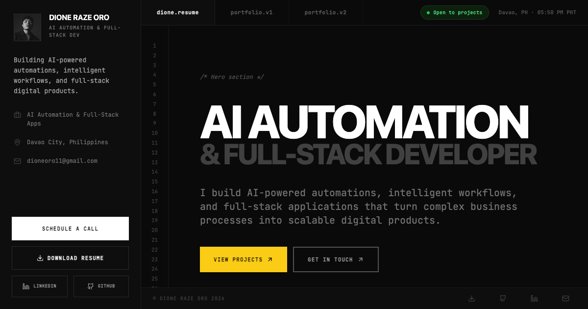
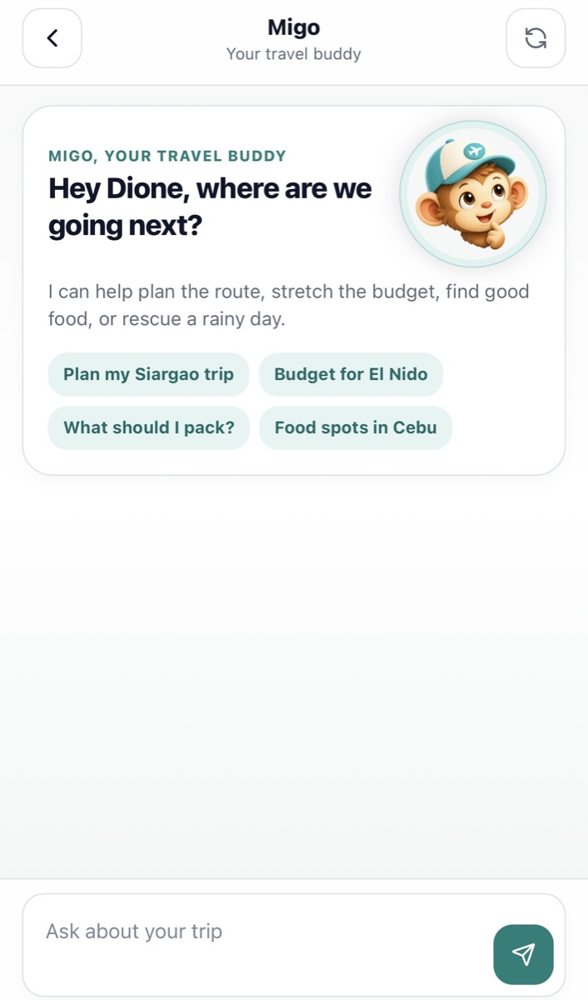
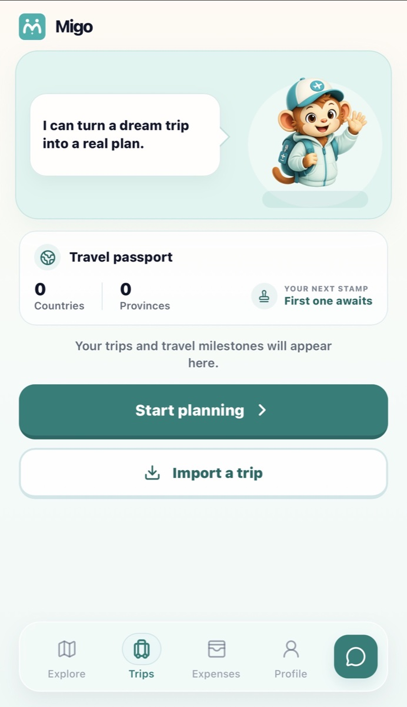
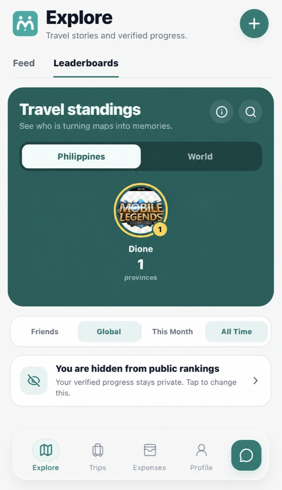
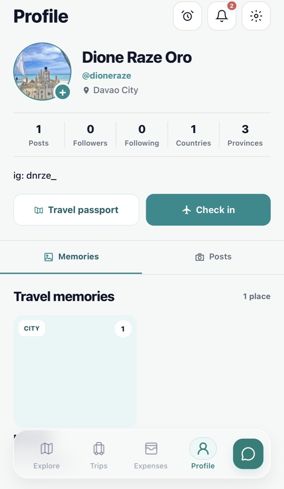

# Dione Raze Oro — Developer Portfolio

A responsive developer portfolio showcasing AI automation systems, full-stack products, API integrations, and practical software built for real business and travel problems.



## Live Demo

[View the portfolio](https://dione-works.vercel.app/)

## Overview

This portfolio presents selected work across AI automation, full-stack development, conversational systems, and connected business workflows. It includes detailed case studies, live product links, technology summaries, and ways to contact or schedule a call with Dione.

## Problem It Solves

A conventional résumé cannot clearly demonstrate how a developer approaches product problems, automation design, integrations, and implementation. This portfolio brings that evidence together in one accessible experience for clients, employers, and collaborators.

## Main Features

- Featured full-stack products with live demos
- AI automation and workflow case studies
- Project problem, solution, and impact breakdowns
- Responsive desktop and mobile interface
- Searchable portfolio assistant
- Technology and service overview
- Contact links, résumé download, and Calendly integration
- Motion and reduced-motion accessibility support

## Featured Products

### Migo

A mobile-first travel platform combining AI-assisted planning, trip organization, expenses, passport progress, community features, and travel memories.

[View Migo](https://migo-rust.vercel.app/)

### Laag Bukidnon

A responsive tourism platform that helps travelers discover destinations, find stays, access local guidance, and plan trips around Bukidnon.

[View Laag Bukidnon](https://laagbukidnon.vercel.app/)

## Technology Stack

- React 19
- TypeScript
- Vite
- Tailwind CSS
- Framer Motion
- Lucide React
- Vercel

The portfolio also documents work involving n8n, Make, Zapier, Supabase, PostgreSQL, OpenAI, Claude, APIs, and related development tools.

## Screenshots

### Portfolio preview


### Migo product screens

| AI travel buddy | Trips and passport | Leaderboards | Profile and memories |
| --- | --- | --- | --- |
|  |  |  |  |

## Installation and Setup

### Requirements

- Node.js 22 or later
- npm 10 or later

### Run locally

```bash
git clone https://github.com/dionerazedev-commits/dione.works.git
cd dione.works
npm ci
npm run dev
```

Open `http://localhost:3000` in your browser.

This project does not require API keys for local development.

## Available Scripts

```bash
npm run dev        # Start the local development server
npm run lint       # Run ESLint
npm run typecheck  # Check TypeScript types
npm run build      # Create a production build
npm run preview    # Preview the production build
```

## Project Structure

```text
.
├── components/       # Navigation, portfolio sections, and assistant UI
├── public/           # Images, technology icons, and résumé
├── App.tsx           # Application shell
├── index.tsx         # React entry point
├── index.css         # Global styles
├── index.html        # Metadata and document shell
└── vite.config.ts    # Vite configuration
```

## Quality and Security

- API keys and credentials are not required or committed.
- Environment files are excluded from version control.
- Type checking, linting, and production builds run in continuous integration.
- Reduced-motion preferences are respected through Framer Motion.

## Future Improvements

- Split large portfolio sections into smaller feature modules
- Add component and accessibility tests
- Move externally hosted project images into controlled storage
- Add dedicated public repositories for selected automation systems
- Expand case studies with architecture diagrams and measurable outcomes

## Contact

- Portfolio: [dione-works.vercel.app](https://dione-works.vercel.app/)
- Email: [dioneraze.dev@gmail.com](mailto:dioneraze.dev@gmail.com)
- LinkedIn: [Dione Raze Oro](https://www.linkedin.com/in/dione-raze-oro-b274a8243/)
- GitHub: [dionerazedev-commits](https://github.com/dionerazedev-commits)

---

Built by Dione Raze Oro.
